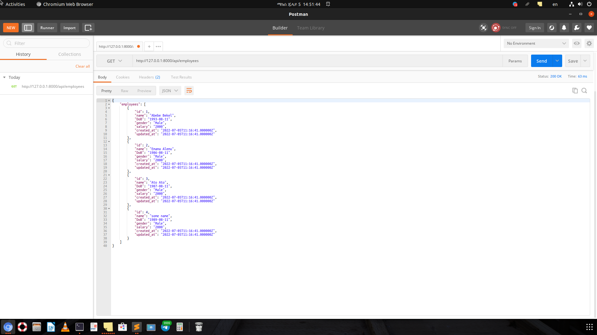
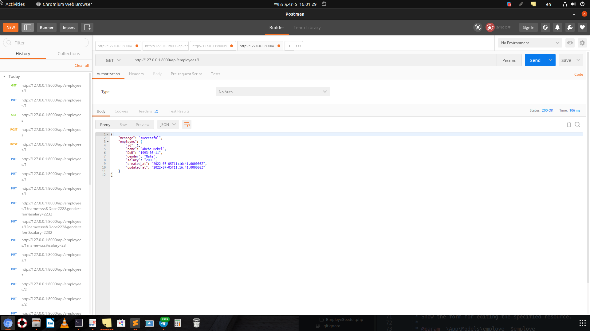
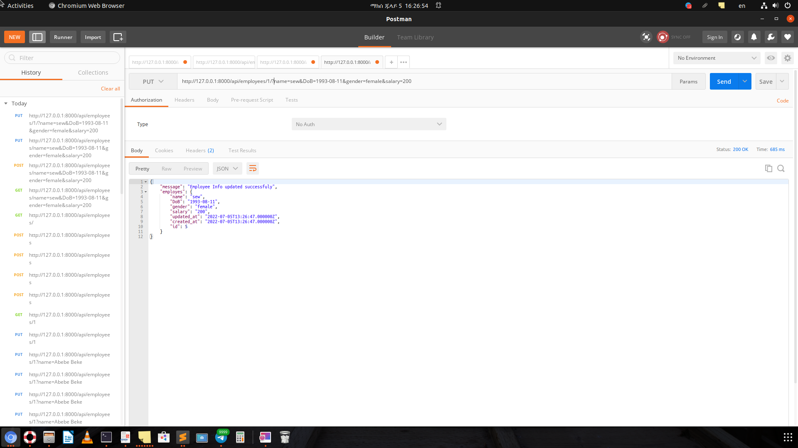
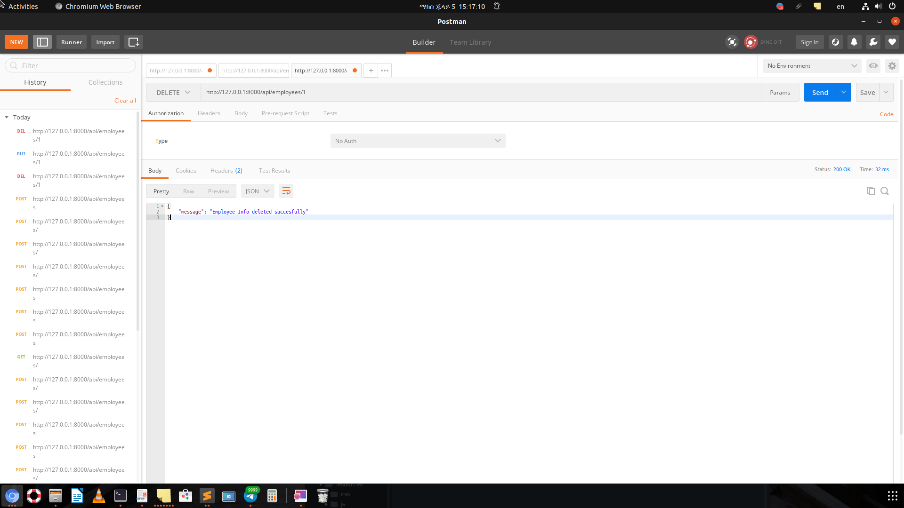

<!-- PROJECT SHIELDS -->

<!-- PROJECT LOGO -->
 

  

  <h3 align="center">REST API with Laravel 9</h3>

  

    An awesome README template to jumpstart your projects!
     
    <a href="https://sewasew2127.github.io/My-Portfolio/"><strong>Get to know me more, here is my portfolio »</strong></a>
     
     
  

<!-- TABLE OF CONTENTS -->

  
Table of Contents

  <ol>
    <li>
      <a href="#about-the-project">About The Project</a>
      <ul>
        <li><a href="#built-with">Built With</a></li>
        <li><a href="#rest-api"> REST API</a></li>
        <li><a href="#laravel"> Laravel </a> </li>
        <li><a href="#postman"> Postman </a></li>
        <li><a href="#testing-the-project-with-postman"> Testing the project with postman </a></li>
      </ul>
    </li>
    <li><a href="#contact">Contact</a></li>
    </ol>

<!-- ABOUT THE PROJECT -->
## About The Project

This project is built to simply show the REST API using Laravel 9. The project uses a simple database (MySql) with an employee table that is populated with fake data by using the laravel seeder functionality.

### Built With

The project is built with:-

* [Laravel 9](https://laravel.com/docs/9.x/releases)
* [MYSQL (Lampp stack](https://www.apachefriends.org/)
* [Vue.js](https://vuejs.org/)
* [Laravel](https://laravel.com)

### REST API
A REST API (also known as RESTful API) is an application programming interface (API or web API) that conforms to the constraints of REST architectural style and allows for interaction with RESTful web services. REST stands for representational state transfer. 

### Laravel
Laravel is a PHP framework developed with PHP developer productivity in mind. The framework also aims to evolve with the web and has already incorporated several new features and ideas in the web development world, such as job queues, API authentication out of the box, real-time communication, and much more.

### Postman
Postman is an application used for API testing. It is an HTTP client that tests HTTP requests, utilizing a graphical user interface, through which we obtain different types of responses that need to be subsequently validated. 

(<a href="#top">back to top</a>)

### Postman Methods
Postman offers many endpoint interaction methods. The following are some of the most used, including their functions:

* GET: Obtain information 
* POST: Add information
* PUT: Replace information
* PATCH: Update certain information
* DELETE: Delete information

### Testing the project with postman
* Get  ALL
	- Method -> GET
	- URL -> https//127.0.0.1:8000/employees

* Get  A SPECFIC
	- Method -> GET
	- URL -> https//127.0.0.1:8000/employees/1

* Post
	- Method -> POST
	- URL -> http//127.0.0.1:8000/employees
	- Here I used a new test with a json data consisting of the employee data

* Update
	-  Method -> UPDATE
	- URL -> http//127.0.0.1:8000/employees/name=sth&salary=34
	

* Delete
	-  Method -> DELETE
	- URL -> http//127.0.0.1:8000/employees/1
	

* The above screen shots and other test screen shots can be found in the ~/images directory of this repository
<!-- GETTING STARTED -->

(<a href="#top">back to top</a>)

<!-- CONTACT -->
## Contact

* Name -Sewasew Hailu
* Email - sewasew.hailu@gmail.com 
* Linkidin -[Sewasew Hilue](https//www.linkedin.com/in/sewasew-hailu-b3146780?lipi=urn%3Ali%3Apage%3Ad_flagship3_profile_view_base_contact_details%3BqZ1Vs4dHSZKjrd%2FiCoioAA%3D%3D)

* Project Link: [https://github.com/Sewasew2127/Laravel-CRUD-REST-API](https://github.com/Sewasew2127/Laravel-CRUD-REST-API)

(<a href="#top">back to top</a>)

